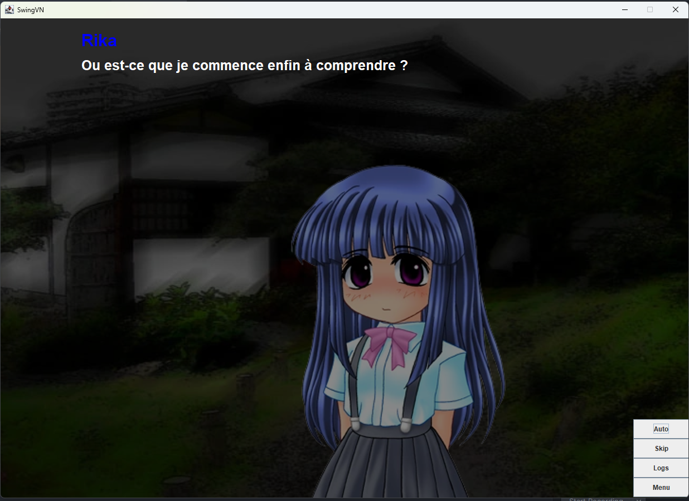

# SwingVN

SwingVN is an work in progress visual novel engine written in Java, using Swing.

The project is fully customizable and only the Script class is sufficient to write your own VN.

An official documentation will be soon available.

### Screenshot



### How to install and edit

1. Make sure [Git](https://git-scm.com/install/) is installed on your system.

2. Open a terminal and clone the repository:

   ```bash
   git clone https://github.com/SpriSan/SwingVN.git
   ```

3. Change your current directory to the newly created project folder:

   ```bash
   cd SwingVN
   ```

4. Build and run the project using your IDE.

> ⚠ Note: Running from source requires **JDK 21** to be installed.

## Tools Used

* Java Development Kit (JDK) 21
* Swing (for the UI)

## Credits

* Used assets are from Higurashi.